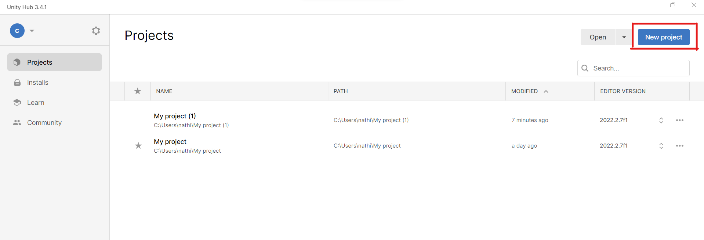
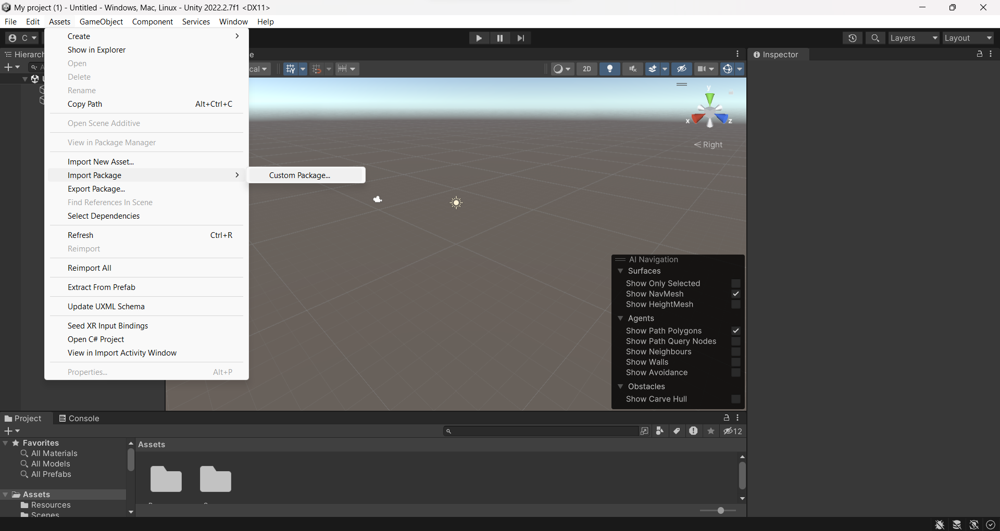
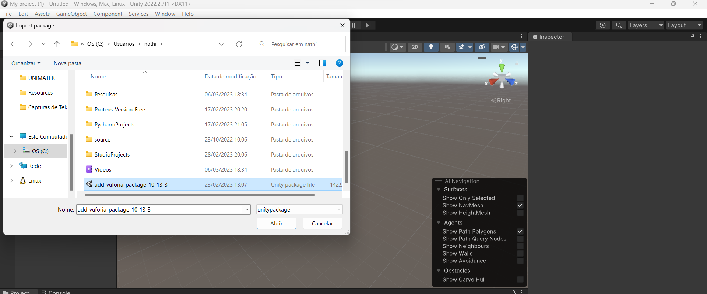
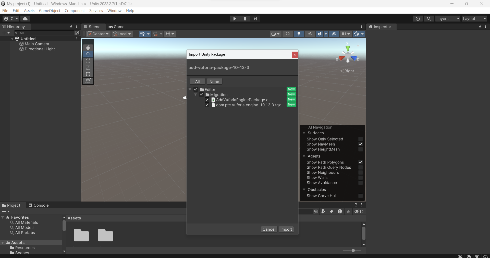
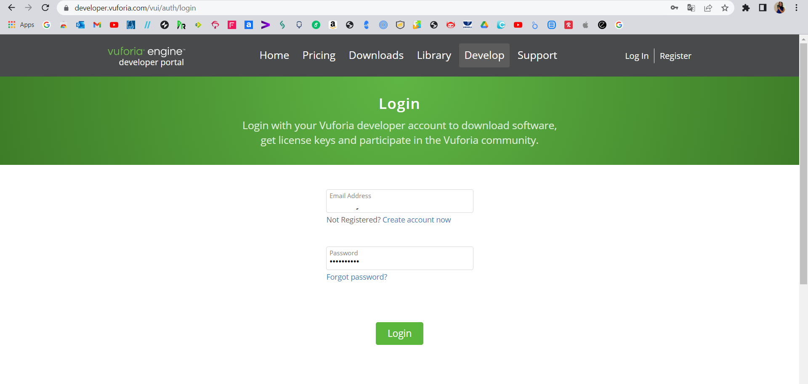
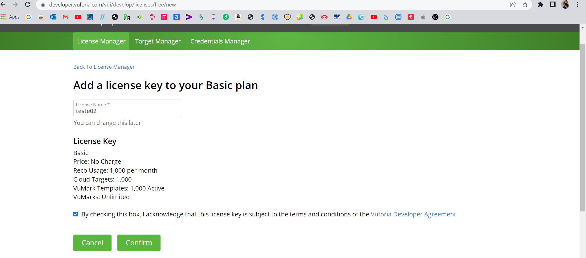
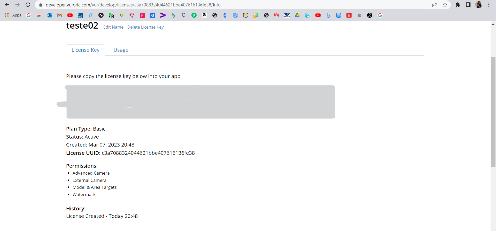
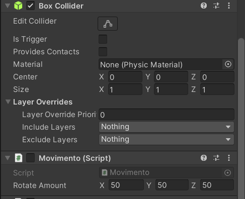

## Olá, Devs!! 👋

<a href="http://www.colorado.edu/studentgroups/vrarclub/">
    
</a>

<p> Hoje vamos criar uma Realidade Aumentada no Unity com o Vulforia. </p>
<p>Essas duas ferramentas possibiltam a criar aplicações avançadas em AR de forma simples:</p>
<p>Para fazer o download do Unity, basta entrar no link abaixo: </p>
<p><a href= "https://unity.com/pt/download">Dowloand Unity<a/></p>

<p></p>
<p>Logo após você tem que fazer o download do Vulforia, que está dispónivel no link abaixo: </p>
<p> <a href="https://developer.vuforia.com/vui/auth/login?url=%2Fdownloads%2Fsdk%3F_%3D1678117884"> Download Vulforia</a></p>

## Configurando os pacotes

<p>Logo após o download do Unity, você precisará adicionar o pacote "add-vuforia-package-10-13-3", a seguir a demontração de como fazer essa configuração:</p>
<p> * Primeiro passo abra o seu Unity na Área de Trabalho e em seguida crie um novo projeto no canto direito superior da tela:</p>
<p align="center">

</p>

<p> * Segundo passo importamos o pacote "add-vuforia-package-10-13-3":</p> 
<p align="center">

</p>
<p>Caminho: Assets/Import Package/ Custom Packege..</p>

<p> * Terceiro passo seleciona o pacote</p>
<p align="center">

</p>

<p> * Último passo vai aparecer um pop-up dos pacote de unidade de importação, aceite todos e depois de um "import"</p>
<p align="center">

</p>

##Licença 

<p></p>
<p>Logo após fazer o downloand e configurar o pacote vai ser necessário fazer uma conta no Vulforia para ter uma licença </p>
<p>Para a criação dessa licença basta entrear no site: <a href= "https://developer.vuforia.com/vui/auth/login" > Vuforia License Manager <a/></p>
<p>Entre com o seu login e senha(ou caso não tenha crie uma conta gratuita)</p>
<p align="center">

</p>
<p>No canto superior direito temos os Develop, clique nessa opção, você cairá em uma página como essa:</p>
<p align="center">

</p>
<p>Entre no Get Basic, para criar a licença, coloque um nome e depois em "Confirm"</p>
<p align="center">

</p>
<p>Clicando novamente na licença criada você terá o Key da sua licença:</p>
<p align="center">

</p>

##

<p>Para poder criar a Target</p>
<p></p>


<p></p>

# Montando a imagem 
<p>Na imagem abaixo mostra a ultilização da imagem e como coloca a licença:</p>

<p></p>

# Scripts Rotacionar o Cubo 

```javascrip
using System.Collections;
using System.Collections.Generic;
using UnityEngine;

public class Movimento : MonoBehaviour
{
    public Vector3 rotateAmount;
    void Start()
    {
        
    }

    // Update is called once per frame
    void Update()
    {
        transform.Rotate(rotateAmount * Time.deltaTime);
    }
}
```

# Movimento com o dado 
```javascrip
using System.Collections;
using System.Collections.Generic;
using UnityEngine;

public class Movimento : MonoBehaviour

{

    // Start is called before the first frame update

    Vector3 Vec;

    void Start()

    {    

    }

    // Update is called once per frame

    void Update()

    {

        Vec = transform.localPosition;

        Vec.y += Input.GetAxis("Jump") * Time.deltaTime * 5;

        Vec.x += Input.GetAxis("Horizontal") * Time.deltaTime * 5;

        Vec.z += Input.GetAxis("Vertical") * Time.deltaTime * 5;

        transform.localPosition = Vec;

    }

}


}
```
# Movimento com o teclado 

```javascrip
using System.Collections;
using System.Collections.Generic;
using UnityEngine;

public class Teclado : MonoBehaviour
{
    // Start is called before the first frame update
    void Start()
    {
        
    }

   // Update is called once per frame
    void Update()
    {
        if(Input.GetKey(KeyCode.LeftArrow))
        {
            transform.Translate(0.1f, 0f, 0f );
        }
        if(Input.GetKey(KeyCode.RightArrow))
        {
            transform.Translate(-0.1f, 0f, 0f );
        }
        if(Input.GetKey(KeyCode.DownArrow))
        {
            transform.Translate(0f, 0f, 0.1f );
        }
        if(Input.GetKey(KeyCode.UpArrow))
        {
            transform.Translate(0.1f, 0f, -0.1f );
        }

    }
}
```


# Rotacionar a imagem
**Para fazer a rotação do cubo é preciso colocar o eixo de rotação**
<p>X = 50, Y = 50, Z = 50.</p>

