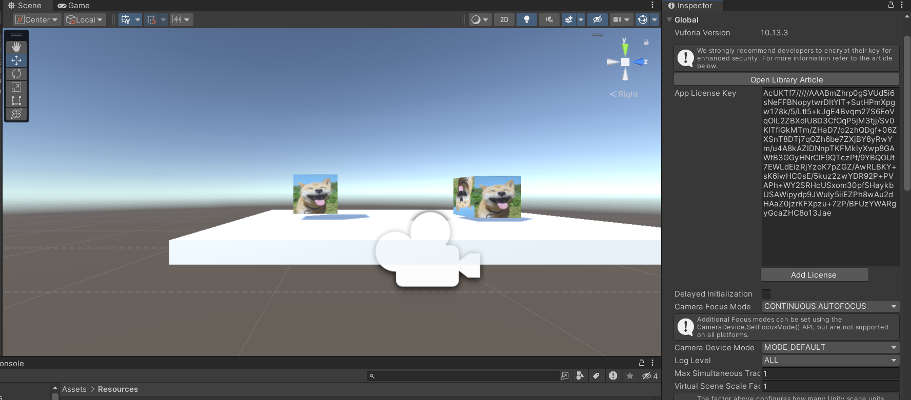
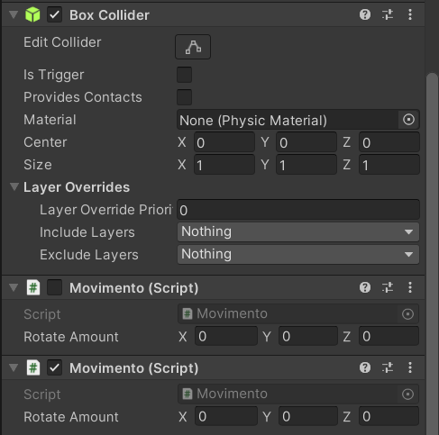

# Realidade-Aumentada-Unity
**Criação da Realidade Aumentada do Unity com o Vulforia:**
<p>Essas duas ferramentas possibiltam a criar aplicações avançadas em AR de forma simples:</p>
<p>Para fazer o download do Unity, basta entrar no link abaixo: </p>
<p><a href= "https://unity.com/pt/download">Dowloand Unity<a/></p>

<p></p>
<p>Logo após você tem que fazer o download do Vulforia, que está dispónivel no link abaixo: </p>
<p> <a href="https://developer.vuforia.com/vui/auth/login?url=%2Fdownloads%2Fsdk%3F_%3D1678117884"> Download Vulforia</a></p>

<p></p>
<p>Logo após fazer o downloand dos dois aplicativos é necessário fazer uma conta para ter uma licença </p>
<p>Para poder criar a Target</p>
<p></p>


<p></p>

# Montando a imagem 
<p>Na imagem abaixo mostra a ultilização da imagem e como coloca a licença:</p>

<p></p>

# O script para rotacionar o Cubo 

```javascrip
using System.Collections;
using System.Collections.Generic;
using UnityEngine;

public class Movimento : MonoBehaviour
{
    public Vector3 rotateAmount;
    void Start()
    {
        
    }

    // Update is called once per frame
    void Update()
    {
        transform.Rotate(rotateAmount * Time.deltaTime);
    }
}
```

# Rotacionar a imagem
<p>**Para fazer a rotação do cubo é preciso colocar o eixo de rotação**</p>
<p>X = 50, Y = 50, Z = 50.</p>

